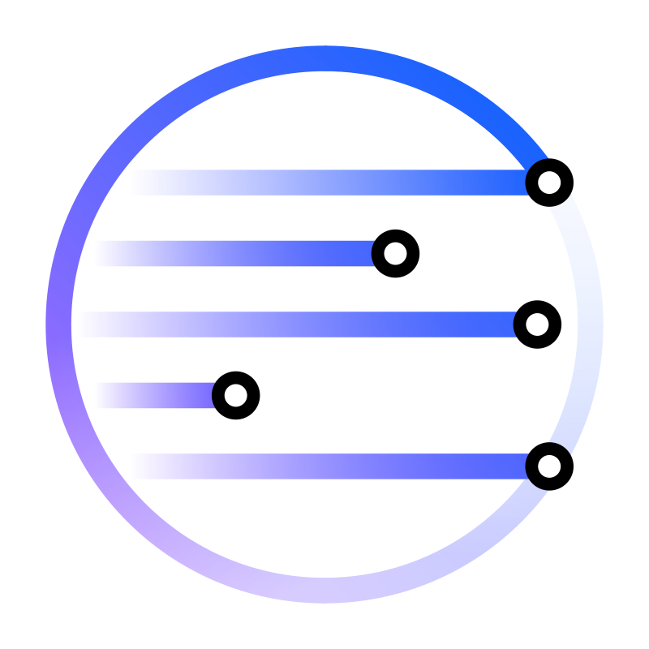

#  OSCAL Compass Community

## Welcome to the OSCAL Compass Community repository

The OSCAL Compass project is a set of tools that enable the creation, validation, and governance of documentation artifacts for compliance needs. It leverages NIST's OSCAL ([Open Security Controls Assessment Language](https://pages.nist.gov/OSCAL/)) as a standard data format for interchange between tools and people, and provides an opinionated approach to OSCAL adoption.

OSCAL Compass is made up of several projects with different release cycles. Collectively, these enable end-to-end automation of various compliance processes. This repository shares OSCAL Compass's activity and collaboration details across the community and include the most current information about the project.

Contributing new features, resolving bugs and issues, and refining the documentation experience through pull requests are welcome. More information about contributing to the OSCAL Compass projects, contributor roles, governance and legal, and licenses can be found in proceeding sections of this document.

## Community Goals

The goals of this open source community includes the following:

* Drive adoption of the OSCAL standard using Trestle, Agile Authoring, and C2P tools for end-to-end compliance automation.
* Come up with use-cases for automating compliance processes in an organization and the required tooling support.
* Influence the OSCAL standard based on the requirements and use-cases identified.


## Learn about the projects

[Trestle](https://github.com/oscal-compass/compliance-trestle)

Trestle is an ensemble of tools that enable the creation, validation, and governance of documentation artifacts for compliance needs. It leverages NIST's OSCAL as a standard data format for interchange between tools and people, and provides an opinionated approach to OSCAL adoption.

Trestle is designed to operate as a CI/CD pipeline running on top of compliance artifacts in git, to provide transparency for the state of compliance across multiple stakeholders in an environment friendly to developers. Trestle passes the generated artifacts onto tools that orchestrate the enforcement, measurement, and reporting of compliance.

[Agile Authoring](https://github.com/oscal-compass/compliance-trestle-agile-authoring)

Agile Authoring is a collaborative platform enabling various compliance personas to orchestrate their individual aspects of the compliance artifacts via an interface of their choice. It is a Trestle-based GitOps automated workflow and ensures artifacts consistency and traceability. It provides ready to use CI/CD pipeline configuration and setup using a GitOps approach with Trestle for OSCAL document management and collaboration.

[Compliance to Policy](https://github.com/oscal-compass/compliance-to-policy) (aka C2P)

Compliance-to-Policy (C2P) bridges Compliance as Code and Policy as Code. C2P takes Compliance requirements and generates technical policies for Policy Validation Points (PVPs), and takes PVP native results and generates Compliance Assessment Results. C2P reduces the cost to implement the interchange between Compliance artifacts and PVP proprietary artifacts. C2P is extensible to various PVPs through plugin.

## Community meetings and communications

##### Scheduled meetings

Please attend! All are invited.

**When**:

Every other Tuesday starting on April 23, 2024 · 11:00 – 11:30am ET
[convert to your local time](https://mytime.io/11am/ET)

**Where**: [Google Meet Link](https://meet.google.com/cfr-rkxp-emg)

Dial in:
(US) +1 319-483-6865‬ PIN: ‪269 825 741‬#\
[More phone numbers](https://tel.meet/cfr-rkxp-emg?pin=9717189704231)

**What**: Meeting agenda and notes [Google Docs](https://docs.google.com/document/d/1XTYM7xnWlIqd-8Nn5-qtgvgk8kH3NSmYle5yZvaS7qs/edit?usp=sharing)

We also have a [shared calendar](https://calendar.google.com/calendar/u/0?cid=NjZjNjdjY2E0ZGZmMWYwN2Q5OGQwZjkxYTMyOGFjZWYyZjRhNjdhMzQzOWYxNGY4NmIyZGU1NmEwYTgzNGEwMUBncm91cC5jYWxlbmRhci5nb29nbGUuY29t).

##### Email

Google Group: [oscal-compass](https://groups.google.com/g/oscal-compass)\
oscal-compass@googlegroups.com


##### Chat anytime

Slack: [#oscal-compliance-trestle-agileauthoring-c2p](https://cloud-native.slack.com/archives/C06F3PEPNBW)

- **Note**: You can login to Slack using another account like Google, Apple

## Contribution

Our project welcomes external contributions. Please consult [contributing](CONTRIBUTING.md) to get started.

## License & Authors

If you would like to see the detailed LICENSE click [here](LICENSE).
Consult [maintainers](MAINTAINERS.md) for the current list of maintainers for various projects in the oscal-compass community.

```text
# Copyright (c) 2020 The OSCAL Compass Authors. All rights reserved.
#
# Licensed under the Apache License, Version 2.0 (the "License");
# you may not use this file except in compliance with the License.
# You may obtain a copy of the License at
#
#     https://www.apache.org/licenses/LICENSE-2.0
#
# Unless required by applicable law or agreed to in writing, software
# distributed under the License is distributed on an "AS IS" BASIS,
# WITHOUT WARRANTIES OR CONDITIONS OF ANY KIND, either express or implied.
# See the License for the specific language governing permissions and
# limitations under the License.

```
