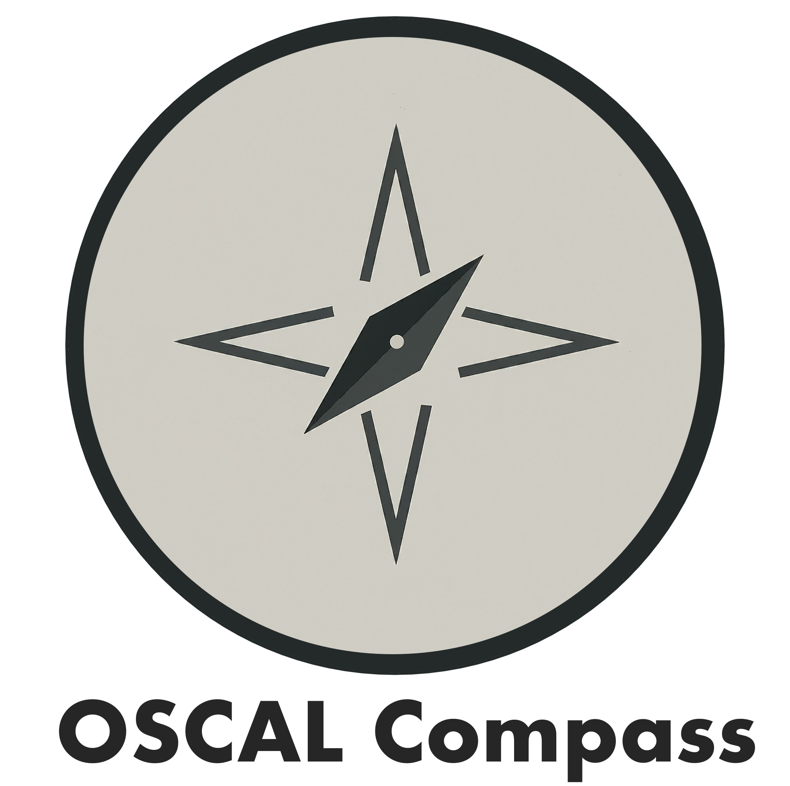

# Welcome to the OSCAl Compass community repository
<picture>
  
</picture>

----

The OSCAL Compass project is a set of tools that enable the creation, validation, and governance of documentation artifacts for compliance needs. It leverages NIST's OSCAL ([Open Security Controls Asessment Language](https://pages.nist.gov/OSCAL/)) as a standard data format for interchange between tools and people, and provides an opinionated approach to OSCAL adoption.

## Get Started with OSCAL Compass

* Check out the [Community README](https://github.com/oscal-compass/community/blob/main/README.md) to get started with using and contributing to the project.
* You can find all the ways to collaborate with project maintainers and your fellow users of OSCAL Compass tools by visiting our [project collaboration](https://github.com/oscal-compass/community/blob/main/Collaboration.md) page.

## Learn about the projects

[Trestle](https://github.com/oscal-compass/compliance-trestle) - Command line tool and SDK for interacting with OSCAL-based documents

[Agile Authoring](https://github.com/oscal-compass/compliance-trestle-agile-authoring) - Ready to use CI/CD pipeline configuration and setup using a GitOps approach with Trestle for OSCAL document management and collaboration.

[Compliance to Policy](https://github.com/oscal-compass/compliance-to-policy) (aka C2P) - C2P bridges compliance-as-code defined in OSCAL and policy validation points (PVP) to generate OSCAL-based results
