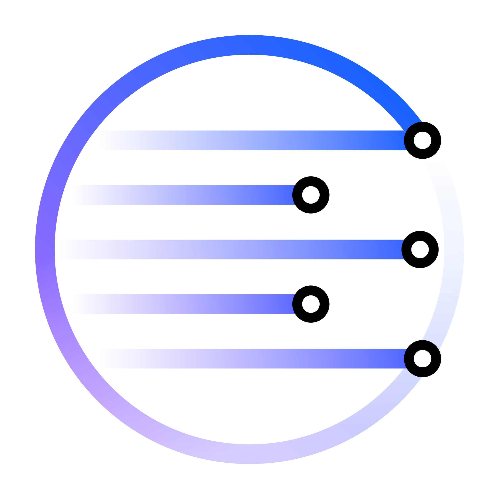

#  OSCAL Compass Community

This repository contains the community documentation and governance for the [OSCAL Compass](https://oscal-compass.dev) project, a set of tools that enable the creation, validation, and governance of documentation artifacts for compliance needs.

For full project information, community meetings, communications, and project descriptions, please visit the [OSCAL Compass Community page](https://oscal-compass.dev/community/).

## Repository Contents

This repository contains the following community documents:

- [Contributing](CONTRIBUTING.md) - How to contribute to OSCAL Compass projects
- [Governance](GOVERNANCE.md) - Project governance and decision making
- [Maintainers](MAINTAINERS.md) - Current list of maintainers across all projects
- [Membership](MEMBERSHIP.md) - Contributor roles and membership requirements
- [Security](SECURITY.md) - Security policy and reporting

## Contribution

Our project welcomes external contributions. Please consult [CONTRIBUTING.md](CONTRIBUTING.md) to get started.

## License & Authors

If you would like to see the detailed LICENSE click [here](LICENSE).
Consult [MAINTAINERS.md](MAINTAINERS.md) for the current list of maintainers.

```text
# Copyright (c) 2026 The OSCAL Compass Authors.
#
# Licensed under the Apache License, Version 2.0 (the "License");
# you may not use this file except in compliance with the License.
# You may obtain a copy of the License at
#
#     https://www.apache.org/licenses/LICENSE-2.0
#
# Unless required by applicable law or agreed to in writing, software
# distributed under the License is distributed on an "AS IS" BASIS,
# WITHOUT WARRANTIES OR CONDITIONS OF ANY KIND, either express or implied.
# See the License for the specific language governing permissions and
# limitations under the License.
```

______________________________________________________________________

We are a Cloud Native Computing Foundation sandbox project.

<picture>
  <source media="(prefers-color-scheme: dark)" srcset="https://www.cncf.io/wp-content/uploads/2022/07/cncf-white-logo.svg">
  
</picture>

The Linux Foundation® (TLF) has registered trademarks and uses trademarks. For a list of TLF trademarks, see [Trademark Usage](https://www.linuxfoundation.org/legal/trademark-usage).

*OSCAL Compass is an independent open source project. It is not affiliated with, endorsed by, or sponsored by the National Institute of Standards and Technology (NIST) or any other government agency.*

*OSCAL Compass was originally contributed by IBM.*
