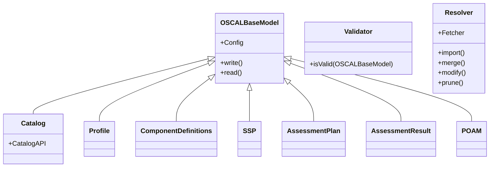

**Checklist**

<!--> Add extra fields for management here <!-->

- [X] Template passes validation with `trestle`
- [X] Proposal cuts across multiple `oscal-compass` projects

## Summary/Abstract

This proposal outlines the rationale and steps for moving the `trestle` SDK from its current location within the CLI repository to a dedicated, standalone repository and separately managed Python package.

## Background

### Motivation and problem space

- **Community and Ecosystem**: There is no clear separation in `compliance-trestle` between what is designed as part of the `trestle` SDK and what directly supports CLI operations outside of the [`repository.py`](https://github.com/oscal-compass/compliance-trestle/blob/develop/trestle/core/repository.py). This can make it difficult to quickly identify and contribute to reusable logic which can limit adoption and growth.

- **Versioning Misalignment**: Updates to one component can introduce breaking changes for the other, making it difficult to maintain compatibility and avoid regressions.

- **Conflicting Dependencies**: When both the SDK and CLI share a common repository and Python package, they must use compatible versions of dependencies. This can lead to conflicts and limitations in the flexibility of both components. For instance, pinning dependencies for the CLI can provide stability but can limit flexibility and compatibility with different environments and applications for the SDK.

- **Scalability**: Managing the SDK in a separate repository would make it more straightforward to add new SDKs for other languages.

### Impact and desired outcome

**Improved Maintainability**: By reducing complexity and streamlining updates, the separation can make it easier to maintain and support both components.

**Increased Support for SDK Users**: Independent development and testing can lead to enhanced documentation and code quality targeting the SDK user.

## User/User Story (Optional)

None

### Prior discussion and links

Initial discussion occurred in the OSCAL Compass [community meeting](https://www.youtube.com/watch?v=uUGv3HXlTrI&t=19s  ) on June 14, 2024 pertaining to the reusability of `Rule` logic to support this [issue](https://github.com/oscal-compass/compliance-trestle/issues/1475). An [issue](https://github.com/oscal-compass/community/issues/28) in the community repo was subsequently submitted.

## Goals

- `compliance-trestle` continues to contain the `trestle` CLI logic
- `compliance-trestle-python` is created as the Python SDK repository
- `compliance-trestle` and other OSCAL Compass projects migration to the new SDK for applicable logic

## Non-Goals

- Fundamentally changing the architecture or design of the SDK or CLI is out of scope.
- Expanding the SDK to other programming languages is out of scope (future consideration).

## Proposal

The solution proposed in this document is to move certain pieces of the codebase located in the [compliance-trestle](https://github.com/oscal-compass/compliance-trestle) repository to a new repository containing a Python-based SDK for interaction with OSCAL documents.

Below is high-level description of what would be moved:

**OSCAL Classes**: The classes that represet the OSCAL data model.  
**Core Functionality**: Contains the fundamental APIs for interacting with OSCAL objects.  
**Abstractions**: Abstractions for common operations like resolution or core OSCAL validation.  
  

## Design Details

Below is diagram with existing `trestle` logic that is proposed to be part of the SDK. Links to where this type of logic exists currently are included:

### Relevant Links

 - OSCAL Classes: https://github.com/oscal-compass/compliance-trestle/tree/develop/trestle/oscal
  - Core Logic: https://github.com/oscal-compass/compliance-trestle/blob/develop/trestle/core/models/
  - Abstractions: 
    - https://github.com/oscal-compass/compliance-trestle/tree/develop/trestle/core/resolver
    - https://github.com/oscal-compass/compliance-trestle/blob/dfe892936e5960ad64f6f387dbe5918314049e89/trestle/core/validator.py

## Impacts / Key Questions

Some of my main questions around this proposal are the following:

- What will the contribution process look like for logic in `trestle`?
- Will the SDK be maintained by the `compliance-trestle` maintainer or by a new set of maintainers?

### Pros

- **Improved maintainability**: Easier to manage and update individual components.
- **Enhanced reusability**: SDK can be used in more applications and simplify contributions.  
- **Reduced risk of breaking changes**: Fewer unintended consequences around codebase changes.

### Cons

- **Increased complexity**: Managing two separate repositories mean more project infrastructure to manage.
- **Initial effort**: Moving the SDK to a new repository requires upfront work.

## Risks and Mitigations

- **User Impact**: Breaking changes and movement will affect current SDK users and this will require community notifications and discussion as well as migration documentation.

### Security Considerations

- **Increased Attack Surface**: Managing more repositories and  distinct codebases can potentially increase the attack surface.

## Future Milestones (Optional)

- Add a Go SDK to better support the C2P Go version and expand potential for integrations in the cloud native space.

## Implementation Details (Optional) 

### Testing Plan

This should be defined per sub-project repository.

### Update/Rollback Compatibility

The `compliance-trestle-python` SDK could be created first to test the rollout and once confirmed that it works as expected, the duplicate logic in `trestle` can removed and a new major version of `trestle` can be released. Version v3 of `compliance-trestle` will be available for users to rollback.

### Scalability

This change mainly impact project scalability and maintenance as noted in the above sections.

### Implementation Phases/History

Implementation details will be tracked in an issue on `compliance-trestle`. This will be linked here once/if accepted.